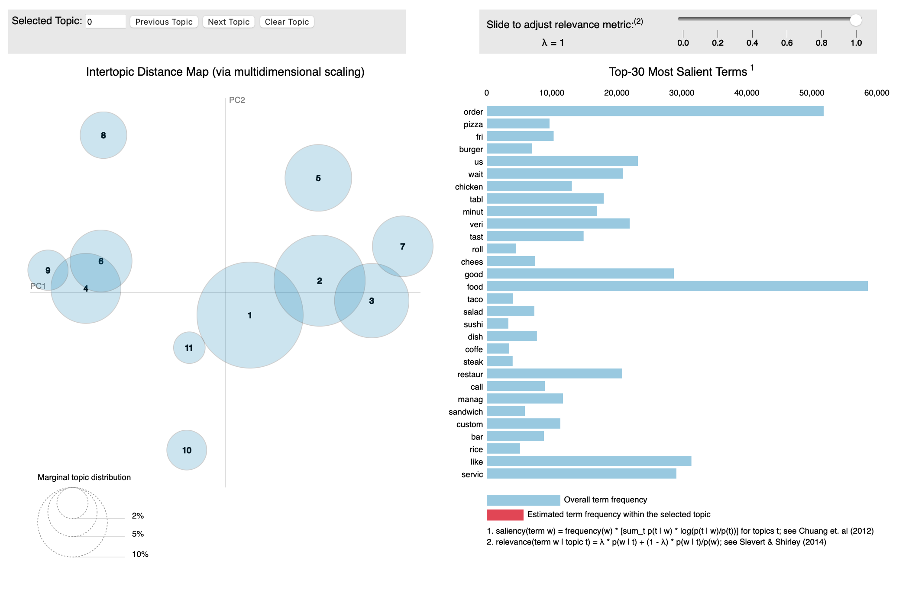

# Améliorez le produit IA de votre start-up

**Projet n° 6** du parcours [Ingénieur IA](https://openclassrooms.com/fr/paths/188-ingenieur-ia) chez [Openclassrooms](https://openclassrooms.com/fr/)

## Description

Vous êtes Ingénieur IA au sein de la startup “Avis Restau”, qui met en relation des clients et des restaurants.

Votre entreprise souhaite améliorer sa plateforme avec une **nouvelle fonctionnalité de collaboration**. Les utilisateurs pourront par exemple poster des avis et des photos sur leur restaurant préféré. Ce sera aussi l’occasion, pour l’entreprise, de mieux comprendre les avis postés par les utilisateurs. 

## Cahier des charges
### Use Case
En tant qu’utilisateur de Avis Restau, je peux :
 - poster des avis sous forme de commentaires.
 - poster des photos prises dans le restaurant.

En tant qu’Avis Restau, je souhaite :
 - Détecter les sujets d’insatisfaction présents dans les commentaires postés sur la plateforme.
 - Labelliser automatiquement les photos postées sur la plateforme. Par exemple, identifier les photos relatives à la nourriture, au décor dans le restaurant ou à l’extérieur du restaurant.

### Scope du projet
Étude préliminaire fonctionnalité “Détecter les sujets d’insatisfaction” et “Labelliser automatiquement les photos postées”

### Jeu de données
Problème : Pas assez de données sur la plateforme Avis Restau.

Solution : utiliser un jeu de données existant de la plateforme Yelp. Contient des informations générales (par exemple type de cuisine) et les avis des consommateurs sur les différents restaurants.

### Collecte des données
Problème : s’assurer de la possibilité de collecter de nouvelles donnéesSolution : collecter de nouvelles données via l’API Yelp. Valider la faisabilité de la solution en collectant les  informations relatives à environ 200 restaurants pour une ville en utilisant l’API

### Outils
Python et librairies spécialisées NLP/CV.Jupyter Notebook et package Voilà

## Réalisation

### Analyse des commentaires pour détecter les différents sujets d’insatisfaction
 - pré-traitement des données textuelles
 - utilisation de techniques de réduction de dimension
 - visualisation des données de grandes dimensions

### Analyse des photos pour déterminer les catégories des photos 
 - pré-traitement des images
 - utilisation de techniques de réduction de dimension
 - visualisation des données de grandes dimensions

### Collecte d'échantillon de données via l’API Yelp :
 - Fichier CSV de l'API
 - récupérer uniquement les champs nécessaires
 - stocker les résultats dans un fichier exploitable (par exemple csv)

# Site
Sur le site https://avisrestau.lignedemire.eu 

## Word Cloud

## Latent Dirichlet Allocation interactif

## Classification des images (avec test)

Note : Aucune donnée n'est conservée sur le site web

